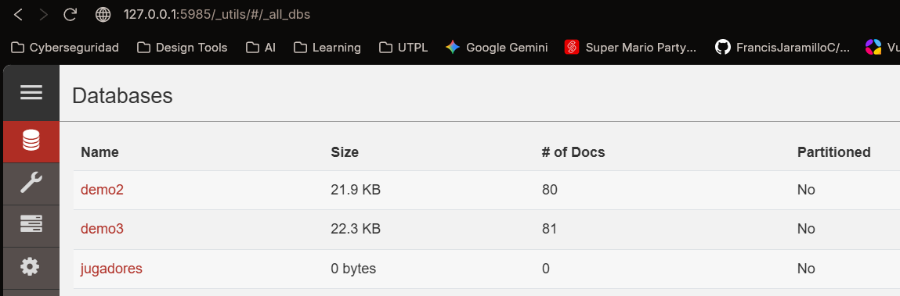

##Evidencias Taller 05
Creacion de la base de datos dentro de couch DB llamada jugadores


Creacion de los tres scripts para transformarlos a Json

Script csv a jason
```java

import pandas as pd
import json

df = pd.read_csv('../data/fuente_csv_sudamerica.csv')
docs = df.to_dict(orient='records')

with open('sudamerica.json', 'w', encoding='utf-8') as f:
    json.dump(docs, f, indent=4, ensure_ascii=False)
    
print(f"Generado sudamerica.json con {len(docs)} registros.")
```

Script html a json
```java

import pandas as pd

tablas = pd.read_html('../data/fuente_html_europa.html')

# Tomar la primera tabla
df = tablas[0]

# Renombrar columnas a minúsculas y ajustar "club" a "club_actual" para CouchDB
df.columns = [col.lower() for col in df.columns]
df = df.rename(columns={'club': 'club_actual'})

# Convertir a JSON
df.to_json('europa.json', orient='records', indent=4, force_ascii=False)
print("Tabla HTML convertida a JSON usando pandas.")
```

Script pdf a jason
```java

import pdfplumber
import json

docs = []
headers = []

with pdfplumber.open("../data/fuente_pdf_norteamerica_asia.pdf") as pdf:
    for page in pdf.pages:
        text = page.extract_text()
        if text:
            lines = text.strip().split('\n')
            for line in lines:
                line = line.strip()
                if not line:
                    continue
                parts = line.split()
                if not headers and parts[0].lower() == 'nombre':
                    headers = [p.lower() for p in parts]
                    continue

                if len(parts) >= 5:
                    row_dict = {
                        'nombre': parts[0],
                        'seleccion': parts[1],
                        'posicion': parts[2],
                        'edad': int(parts[3]),
                        'goles': int(parts[4])
                    }
                    docs.append(row_dict)

# Guardar en archivo JSON con la estructura correcta
with open("norteamerica_asia.json", "w", encoding='utf-8') as f:
    json.dump(docs, f, ensure_ascii=False, indent=4)

print(f"PDF convertido a JSON estructurado. Se extrajeron {len(docs)} registros.")
```

Script combinado de todos los Json
```java

import pandas as pd
import json

df = pd.read_csv('../data/fuente_csv_sudamerica.csv')
docs = df.to_dict(orient='records')

with open('sudamerica.json', 'w', encoding='utf-8') as f:
    json.dump(docs, f, indent=4, ensure_ascii=False)
    
print(f"Generado sudamerica.json con {len(docs)} registros.")

//para combinar todos los Json hicimos uso e implementación de la herramienta bulk_docs
```


Evidencias de cargas en couchDB
```java
import requests
import json

url_base = 'http://127.0.0.1:5985'
base_datos = "jugadores"
url = f"{url_base}/{base_datos}"
headers = {'Content-Type': 'application/json'}

with open('mundial_2026.json', 'r', encoding='utf-8') as f:
   
    data = json.load(f)

lista_datos = []

for d in data['docs']:
    lista_datos.append(d)
# bulk
url_bulk = f"{url}/_bulk_docs"
datos_finales = {'docs': lista_datos}
response_bulk = requests.post(url_bulk, headers=headers, json=datos_finales)

print(f"Inserción masiva finalizada. Código: {response_bulk.status_code}")

design_doc = {
    "_id": "_design/losjugadores",
    "views": {
        "por_club": {
            "map": "function(doc) { if (doc.club_actual) { emit(doc.club_actual, doc); } }"
        },
        "por_goles": {
            "map": "function(doc) { if (doc.goles) { emit(doc.goles, doc); } }"
        },
        "por_partidos": {
            "map": "function(doc) { if (doc.partidos) { emit(doc.partidos, doc); } }"
        }
    }
}

response_vistas = requests.put(
    f"{url}/_design/losjugadores",
    json=design_doc,
    headers=headers
)

if response_vistas.status_code in [201, 202]:
    print("Vistas creadas exitosamente.")
elif response_vistas.status_code == 409:
    res_get = requests.get(f"{url}/_design/losjugadores")
    if res_get.status_code == 200:
        design_doc['_rev'] = res_get.json().get('_rev')
        requests.put(f"{url}/_design/losjugadores", json=design_doc, headers=headers)
        print("Vistas actualizadas exitosamente.")
```
Capturas del Frontend funcionando


Despues de haber cargado los documentos mediante el script cargar_couchb.py
dentro del couchdb debria ncargarse 120 registros en total de los json combinados


Una vez que tengamos cargados los documentos, dentro de Design creamos 3 vistas una para clube otra para goles y por ultimo por partidos de todo el json
se hace con una funcion de mapeo de acuerdo al dato del json


Resultado Vistas

